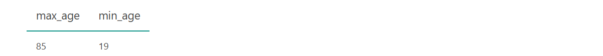
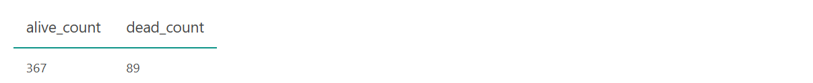
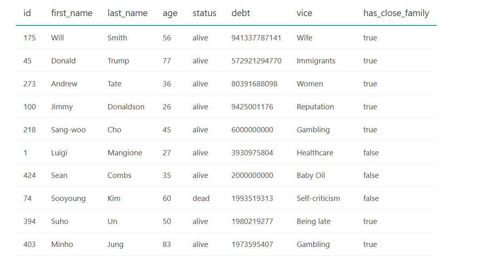
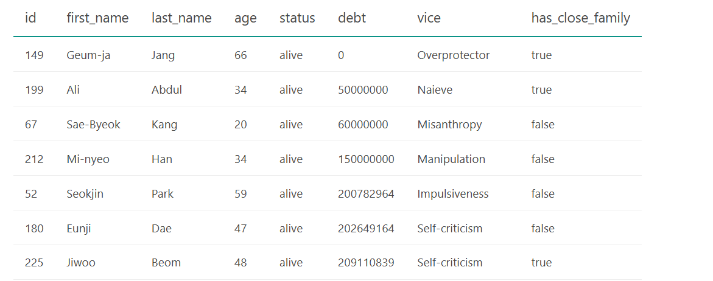

# SQL Squid Game - in progress

I did this project using tasks from the DataLemur's [SQL game](https://datalemur.com/sql-game) inspired by Netflix's Squid Game.

The dataset for the game/project: [csv](https://github.com/VictoriaStetskevych/projects/blob/main/SQL/02_sql_squid_game%20-%20in%20progress/02_squid_games_sql.csv) or [xlsx](https://github.com/VictoriaStetskevych/projects/blob/main/SQL/02_sql_squid_game%20-%20in%20progress/02_squid_games_sql.xlsx)

The Goal - to help the Front Men to analyze data. 

## <u>Initial Data Analysis</u>  

So, before jumping into the game and answering the Front Man's questions, I decided to review the data I received.

```sql
SELECT *
FROM player
```
Result:


- Check the total amount of players
```sql
SELECT COUNT(DISTINCT id) AS unique_id_total
FROM player;    
```
Result:


- As a big fan of the Squid Game TV show, I couldn’t resist checking the player ID numbers from both seasons.
```sql
-- season 1
SELECT *
FROM player
WHERE id IN (456, 67, 218, 199, 101);
-- season 2
SELECT *
FROM player
WHERE id IN (333, 388, 120, 7, 149, 390, 222);    
```
Result;
 


- #001 in the dataset isn’t Oh Il-nam, In-ho, or Oh Young-il, but when I showed my husband who #001 was, he told me it’s a very well-known person. 
```sql

```


- I also checked MAX and MIN ages of players
```
SELECT
	MAX (age) as max_age,
	MIN (age) as min_age
FROM player;
```
Result:


- Then I thought, what if there wasn’t just one player who was 19 or 85? Plus, I knew that the first game, "Red Light, Green Light," was over, so I decided to count the players with the maximum and minimum ages who survived.
```sql
SELECT 
    COUNT(CASE WHEN age = 19 THEN 1 END) AS count_age_19,
    COUNT(CASE WHEN age = 85 THEN 1 END) AS count_age_85
FROM player
WHERE status = 'alive';
```
Result:


- Additionally, I decided to check the number of players who survived/died after the first game.
```sql
SELECT 
	COUNT(CASE WHEN status = 'alive' then 1 END) as alive_count,
	COUNT(CASE WHEN status = 'dead' then 1 END) as dead_count
FROM player;
```
Result:


- I also was curios to check people with biggest debt. I was really surprised to see such unexpected result and these players:
``` 
SELECT * 
FROM player 
ORDER BY debt desc;
```
Result:


- And players with smallest debt
```sql
SELECT * 
FROM player 
ORDER BY debt asc;
```
Result:


## <u>LEVEL 1</u>


Resources:

DataLemur - https://datalemur.com/
SQL Squid Game - https://datalemur.com/sql-game
